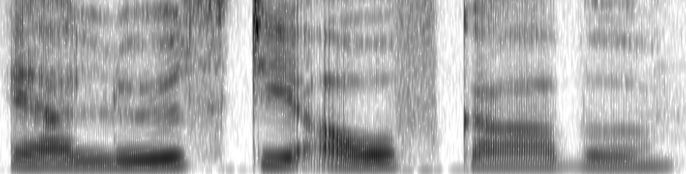

---
#########################################
# options for knitting a single chapter #
#########################################
output:
  bookdown::pdf_document2:
    template: templates/brief_template.tex
    citation_package: biblatex
  bookdown::html_document2: default
  bookdown::word_document2: default
documentclass: book
bibliography: [bibliography/references.bib, bibliography/additional-references.bib]
---

# General methods {#chapter-methods}
\chaptermark{Methods}

This chapter provides an overview of the experimental materials used in the experiments described in Chapters 5, 6, and 7.
Sentences used as experimental material were common in all the experiments,
and the signal processing method was also common.
Here, we also present an overview of online data collection.

## Experimental materials {#experimental-materials}

As a part of a study in the research project A4 of SFB1102, sentences of different levels of predictability were created.
Digital recordings of the sentences were degraded by noise-vocoding and used in all experiments reported in this thesis.
The speech was also distorted by its compression and expansion.
Below we briefly describe how the sentences of different levels of predictability were obtained
and what methodology was used to create distorted versions of the speech.

### Stimulus sentences

With an aim to create sentences of three levels of predictability (low, medium, and high), a triplet of 120 sentences --- a total of 360 sentences --- were created from 120 nouns.
Out of 120 nouns, 6 were repeated.
All sentences were in present tense consisting of pronoun, verb, determiner, and object.
These sentences were in Subject-Verb-Object form (e.g., *Er fängt den Ball*. EN: He catches the ball.).
Some of these sentences were taken from @Obleser2010.
For each sentence, cloze probability ratings were collected from a group of young adults (n = 60; age range = 18–30 years).
Mean cloze probabilities of low, medium and high probability sentences are shown in Table \@ref(tab:cloze-table) and
the distribution of cloze probability across low, medium, and high predictability sentences is shown in Figure \@ref(fig:cloze-distribution).
The cloze probabilities of the target words in each sentence are shown in Appendix \@ref(appendix-A).
<!--
```{=tex}
\begin{table}[ht]
\begin{center}
\caption{Cloze probabilities of low, medium and high predictability sentences} 
\vskip 0.12in
\begin{tabular}{c c c}
\label{cloze-table} 
\toprule
 & \multicolumn{2}{c}{Cloze probability} \\
\cmidrule(l){2-3}
Predictability & Mean $\pm$ SD & Range \\
\midrule
Low & 0.022 $\pm$ 0.027 & 0.00 – 0.09 \\
Medium & 0.274 $\pm$ 0.134 & 0.1 – 0.55 \\
High & 0.752 $\pm$ 0.123 & 0.56 – 1.00 \\
\bottomrule
\end{tabular}
\end{center}
\end{table}
```
-->

: (\#tab:cloze-table) Cloze probabilities of low, medium and high predictability sentences

|                    | Cloze probability |              |
|:------------------:|:-----------------:|:------------:|
| **Predictability** |   Mean $\pm$ SD   |    Range     |
|        Low         | 0.022 $\pm$ 0.027 | 0.00 -- 0.09 |
|       Medium       | 0.274 $\pm$ 0.134 | 0.1 -- 0.55  |
|        High        | 0.752 $\pm$ 0.123 | 0.56 -- 1.00 |


```{r cloze-distribution, eval=TRUE, echo=FALSE, fig.align='center', fig.cap="Distribution of cloze probability ratings of target words in low, medium and high predictability sentences", out.width="90%"}
knitr::include_graphics("figures/materials/cloze-distribution.jpg")
```


### Speech processing {#speech-processing}

All 360 sentences were spoken by a female native speaker of German at a normal rate.
The recordings were digitized at 44.1kHz with 32-bit linear encoding.
Spoken sentences used in Chapters 5, 6, and 7 were degraded by noise-vocoding.
In addition to degradation by noise-vocoding, the sentences were distorted by compression and expansion of speech signal in Chapter 7.

#### Noise-vocoding {#noise-vocoding}

Noise-vocoding is used to parametrically vary and control the speech quality in a graded manner.
It distorts a speech signal by dividing it into specific frequency bands corresponding to the number of vocoder channels.
The frequency bands are analogous to the electrodes of a cochlear implant [@Loizou1999; @Shannon1995; @Shannon2004].
The amplitude envelope, i.e., the fluctuations of amplitude within each frequency band, is extracted, and the spectral information within it is replaced by noise.
This noise-filtering makes the vocoded speech difficult to understand, although its temporal characteristics and periodicity of perceptual cues are preserved [@Rosen1999].

The spectral degradation conditions of 1, 4, 6, and 8 channels were achieved for each of the 360 recorded sentences using a customized script originally written by @Darwin2005 in Praat software [@Praat2001].
The speech signal was divided into 1, 4, 6, and 8 frequency bands between 70Hz and 9,000Hz.
The boundary frequencies were approximately logarithmically spaced following cochlear-frequency position functions [@Erb2014; @Greenwood1990; @Rosen1999].
The amplitude envelope of each band was extracted and applied to band-pass filtered white noise in the same frequency ranges;
the upper and lower bounds for band extraction are specified in Table \@ref(tab:frequencies).
Modulated noise bands were then combined to produce a degraded speech.
Scaling was performed to equate the root-mean-square value of the original undistorted speech and the final degraded speech.
This resulted in four levels of degradation: 1-, 4-, 6-, and 8-channel noise-vocoded speech.

Spectrograms of clear speech and noise-vocoded speech for the sentence *Er löest die Aufgabe* are shown in Figure \@ref(fig:vocoding-spectrogram). It shows that with a decrease in the number of noise-vocoding channels, the information in speech signal reduces and becomes noise-like.

```{r vocoding-spectrogram, eval=TRUE, echo=FALSE, fig.show='hold', fig.pos="!htpb", fig.sep='\\par', fig.align='center', fig.cap="Spectrograms of clear speech, and degraded speech arranged with a decreasing number of noise-vocoding channels (8, 6, 4 and 1 band) for the sentence `Er löest die Aufgabe.' ", out.width="90%"}



knitr::include_graphics(rep(c("figures/materials/aufgabe_8bands.png",
                              "figures/materials/aufgabe_6bands.png"),1))

knitr::include_graphics(rep(c("figures/materials/aufgabe_4bands.png",
                              "figures/materials/aufgabe_1band.png"),1))

```
<!--
```{=tex}
\begin{table}[H]
\begin{center}
\tiny
\caption{Boundary frequencies (in Hz) for 1, 4, 6 and 8 channels noise-vocoding conditions} 
\label{frequencies} 
\vskip 0.12in
\begin{tabular}{llllllllll} 
\hline
Number of channels     &    Boundary frequencies \\
\hline
1   &   70    &   9000   &     &     &       &       &        &       &   \\

4   &   70    &   423   &   1304  &   3504  &   9000    &       &        &       &   \\

6   &   70    &   268   &   633   &   1304  &   2539    &   4813    &    9000    &       &   \\

8   &   70    &   207   &   423   &   764   &   1304    &   2156    &    3504    &   5634    &   9000\\
\hline
\end{tabular} 
\end{center} 
\end{table}
```
-->

: (\#tab:frequencies) Boundary frequencies (in Hz) for 1, 4, 6 and 8 channels noise-vocoding conditions

| Number of channels |Boundary frequencies|                                  
|:--------|:--------:|:--------:|:--------:|:--------:|:--------:|:--------:|:--------:|:--------:|:--------:|
| 1                  | 70                   | 9000 |      |      |      |      |      |      |      |
| 4                  | 70                   | 423  | 1304 | 3504 | 9000 |      |      |      |      |
| 6                  | 70                   | 268  | 633  | 1304 | 2539 | 4813 | 9000 |      |      |
| 8                  | 70                   | 207  | 423  | 764  | 1304 | 2156 | 3504 | 5634 | 9000 |

The primary motivation to degrade speech signals by noise-vocoding is twofold:
On the practical side, noise-vocoding simulates the frequency selectivity with a cochlear implant or sensory-neural hearing loss.
This provides insight into speech perception and language comprehension in special populations (older adults with hearing loss, patients with cochlear implants).
On the experimental side, noise-vocoding preserves the temporal periodicity cues of the speech;
we can investigate the importance of specific suprasegmental cues in speech perception.
Noise-vocoding reduces the fine structure cues that carry the pitch-related suprasegmental information
and allows the study of temporal amplitude envelope cues, which carry the suprasegmental information involved in lexical processing;
noise-vocoding preserves these cues.
It also provides a control over speech intelligibility by varying the number of vocoder channels.

#### Speech compression and expansion {#compression-expansion}

Temporal compression and expansion are used as a method to simulate fast and slow speech, and
to study the effect of acoustic degradation (which is the change in speech rate) and the effect of increase or decrease in information flow.
As early as the mid-twentieth century, investigators reported that intelligibility does not drop significantly when speech is speeded up to 2 times the normal speech rate [e.g., @Garvey1953].
Speech rate was increased by chopping physical tapes.
Digital algorithms like PSOLA [@Charpentier1986; @Moulines1990] developed in the 1980s and later [e.g., @Verhelst1993] now allow us to speed up and slow down the speech rate in a controlled fashion.
In Chapter 7, we used Praat software that utilises a uniform time-compression algorithm (PSOLA) to create slow and fast speech with the compression factor of 1.35 and 0.65, respectively.
A schematic representation of waveforms of different speech rates --- normal, slow and fast --- is shown in Figure \@ref(fig:speech-rate).

```{r speech-rate, eval=TRUE, echo=FALSE, fig.show='hold', fig.pos="!htpb", fig.sep='\\par', fig.align='center', fig.cap="Schematic representation of waveforms of fast, normal, and slow speech rates for the sentence `Er löest die Aufgabe' with the duration of each speech rates in second. Note the circled portion of the waveform, which examplifies that PSOLA eliminates and duplicates the parts of the original waveform to create fast and slow speech respectively.", out.width="90%"}


knitr::include_graphics("figures/materials/aufgabe_normal.png")
knitr::include_graphics("figures/materials/aufgabe_slow.png")

```

PSOLA creates fast or slow speech in three steps: analysis, modification, and synthesis [@Charpentier1986; @Taleb2020].
In the analysis step, it first sets pitch marks in an audio file and then creates segments of it
(i.e., it segments the signal into successive analysis windows centred around those pitch marks).
Then in the modification step, depending on the time-compression/expansion factor, it deletes (or duplicates) those segments and sets a new set of pitch marks.
Finally, in the synthesis step, it adds the new segments back to the audio file (i.e., it rearranges the analysis window) and creates fast or slow speech as required.
The distortion of phonemic properties of speech signals are minimal when accelerating and slowing down within the range of factor 2 or below [@Moulines1990; cf. @Longster2003].

We create fast and slow versions of 120 high and 120 low predictability sentences.
These 480 recordings are then passed through 4 channels noise-vocoding to use as experimental materials.
As discussed [earlier](#research-goals), the main aim of manipulating this bottom-up process is to investigate the effect of change in the rate of information flow (i.e., change in the speech rate) on the top-down processes of contextual facilitation in degraded speech comprehension.

## Data collection on the web {#online-experiment}

Traditionally, behavioural experiments with human participants are conducted in a laboratory setup.
In recent years, there has been a surge of experiments that are conducted on the web [@Reips2021].
The first generation of online experiments to study human cognition began in the mid-1990s [for reviews, @Musch2000] with the advent of the internet [@Bernerslee1992].
@Welch1996 was the first online experiment that was conducted in 1995 as a part of tutorials in auditory perception [@Musch2000].
In their survey of researchers, @Musch2000 discovered that until 2000, there were already at least two psycholinguistic experiments conducted online,
one of which studied the effect of context in shallow vs deep encoding of words.
Despite the difficulty in conducting online experiments and scepticism of journals towards publishing results of online experiments,
@Musch2000 expressed optimism:

>
At the moment, the number of Web experiments is still small, but a rapid growth can be predicted on the basis of the present results.
We would not be surprised if within the next few years, a fair proportion of psychological experiments will be conducted on the Web. (p. 85)
<!-- > -->
<!-- > `r tufte::quote_footer('--- Musch & Reips, 2000, p. 85')` -->


By 2022, there has been significant growth in online experiments as technical and technological barriers are greatly reduced.
There are many software and online platforms which psychologists and psycholinguists can use with minimal knowledge of computer programming
to design, host and run their experiments and retrieve the data in a fairly structured format [@Anwylirvine2020; @Peirce2019; @Prolific; see also, @Anwylirvine2021; @Eyal2022].
Online experiments have demonstrated advantages over laboratory experiments [@Gadiraju2017; @Johnson2021].
For example, a large pool of participants is available online, which is usually not possible in laboratory experiments.
Similarly, the participants in online experiments are more diverse than in laboratory experiments.
Considering these advantages, psychologists and psycholinguists have conducted online experiments for almost three decades.
Scientists who only conducted laboratory experiments and occasional online experiments were forced to conduct their experiments almost exclusively on the web due to the restrictions imposed by covid-19 lockdown [@Gagne2021; @Reips2021].
Since @Welch1996's auditory perception experiment, a number of experiments have been conducted online in the auditory domain [@Leensen2013; @Seow2022; @vanOs2021; @Woods2017] replicating laboratory findings [e.g., @Cooke2021].
The experiments reported in this thesis were also conducted online.

Initially, our experiments were designed to be conducted both in the laboratory and on the web.
As the laboratory was shut down due to covid-19 pandemic-related lockdown (M. Schmitt, personal communication, March 16, 2020), we moved the laboratory experiments to the online platform.
We recruited participants online via Prolific Academic [@Prolific].
We used Prolific's filters to recruit only native speakers of German residing in Germany
who reported not having any hearing loss, speech-language disorder, or cognitive impairment.
Participants were redirected to the experiments that were designed and hosted in Lingoturk [@Pusse2016].
Lingoturk is a local hosting platform that manages crowdsourcing experiments --- it runs the experiments and stores the data.
We report the details of each experiment in Chapters 5, 6, and 7.

