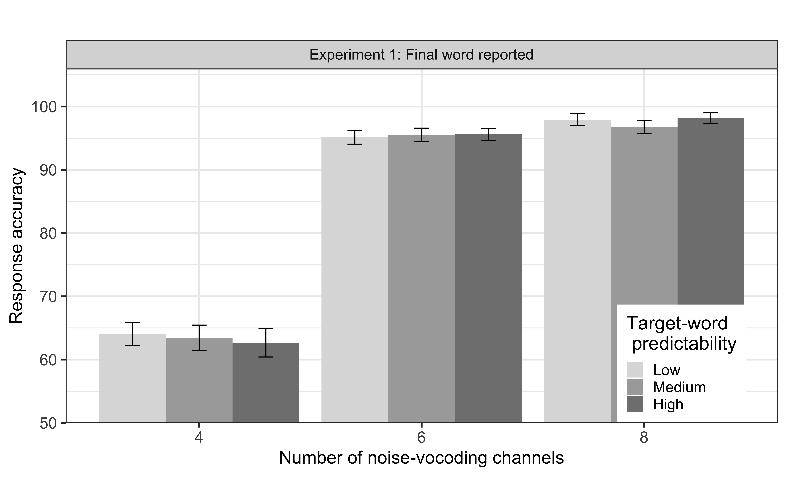
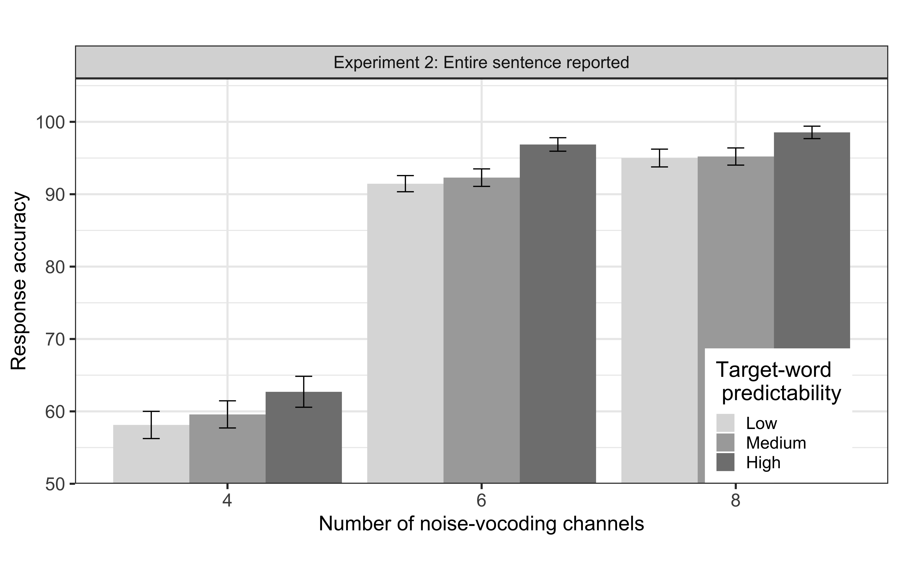

---
output:
  #bookdown::html_document2: default
  #bookdown::word_document2: default
  bookdown::pdf_document2: 
    template: templates/brief_template.tex
    citation_package: biblatex
documentclass: book
bibliography: [bibliography/references.bib, bibliography/additional-references.bib]
---

# Predictability effects of degraded speech are reduced as a function of attention {#chapter-attention-prediction}
\chaptermark{Attention-prediction interplay}

In adverse listening conditions, when the bottom-up perceptual input is degraded, listeners tend to rely on context information and form top-down semantic predictions,
which provides contextual facilitation in understanding the degraded speech.
Importantly, it is also affected by the allocation of attention to the context in a top-down manner.
The aim of this study was to examine the role of attention in understanding linguistic information in an adverse listening condition, i.e., when the speech was degraded.
To assess the role of attention, we varied task instructions in two experiments in which participants were instructed to listen to short sentences and thereafter type in the last word of the sentence they heard or type in the whole sentence.
We were interested in how these task instructions influence the interplay between top-down predictions and bottom-up perceptual processes during language comprehension.
The sentences varied in the degree of predictability (low, medium, and high) as well as in the levels of speech degradation (1-, 4-, 6-, and 8-channel noise-vocoding).
Results indicated better word recognition for highly predictable sentences for moderate, though not for high, levels of speech degradation, but only when attention was directed to the whole sentence.


## Introduction

When there is noise in the signal,
listeners overcome the difficulty of understanding speech by using context information.
The 'context information' can be information in a given situation about a topic of conversation, semantic and syntactic information of a sentence structure, world knowledge, visual information, or even the information about neighbouring phonemes [@Kaiser2004; @Knoeferle2005; @Altmann2007; @Xiang2015; for reviews, see @Ryskin2021; @Stilp2020].
For example, in the *phoneme restoration effect* [@Samuel1996; @Warren1970], a phoneme of one or more words in a sentence is replaced with white noise or a coughing sound.
Participants are unable to notice such 'noisy' words in a sentence, as they perceptually restore the missing sound in those words from the context information.
To utilise the context information in a sentence, listeners must attend to it and build a meaning representation of what has been said.

Processing and comprehending degraded speech is more effortful and requires more attentional resources than clear speech [@Eckert2016; @Hunter2018; @Peelle2018; @Wild2012].
In this chapter, we examine how attention modulates the predictability effects brought about by context information at different levels of spectral degradation of speech.
We address the existing unclarity in the literature regarding the distribution of attentional resources in an adverse listening condition:
On the one hand, listeners can attend throughout the whole stream of speech and may thereby profit from the context information to predict sentence endings.
On the other hand, listeners can focus their attention on linguistic material at a particular time point in the speech stream and, as a result, miss critical parts of the sentence context.
If the goal is to understand a specific word in an utterance, there is a trade-off between allocating attentional resources to the perception of that word and allocating resources also to understanding the linguistic context and generating predictions.

The study reported in this chapter was conducted to investigate how the allocation of attentional resources induced by different task instructions influences language comprehension and, in particular, the use of context information in communication through a noisy channel, i.e., when the speech is degraded.
To examine the role of attention on predictive processing under degraded speech, we ran two experiments in which we manipulated the task instructions.
In [Experiment 1](#experiment1a), participants were instructed to repeat only the final word of the sentence they heard,
while in [Experiment 2](#experiment1b), they were instructed to repeat the whole sentence, drawing attention to the entire sentence, including the context.
In both experiments, we varied the degree of predictability of sentence endings as well as the degree of speech degradation.

## Background

As we discussed earlier in [Chapters 1](#chapter-introduction) and [2](#chapter-background), it is generally agreed upon that human language processing is predictive in nature,
and comprehenders generate expectations about upcoming linguistic materials based on the context available to them [for reviews, see @Kuperberg2016; @Nieuwland2019; @Pickering2018; @Staub2015].
When the bottom-up speech signal is less informative in an adverse listening condition, listeners tend to rely more on top-down lexical-semantic cues from the context to support speech perception and language comprehension [@Amichetti2018; @Ganong1980; @McGurk1976; @Obleser2010; @Sheldon2008b; @Warren1970].
However, it is not just the quality of speech signal that determines and influences the reliance and use of predictive processing;
attention to the auditory input is essential too.
Auditory attention allows a listener to focus on the speech signal of interest [for reviews, see @Fritz2007; @Lange2013].
For instance, a listener can attend to and derive information from one stream of sound among many competing streams, as demonstrated in the well-known *cocktail party effect* [@Cherry1953; @Hafter2007].
When a participant is instructed to attend to only one of the two or more competing speech streams in a diotic or dichotic presentation, response accuracy to the attended speech stream is higher than to the unattended speech [e.g., @Toth2020].
Similarly, when a listener is presented with a stream of tones (e.g., musical notes varying in pitch, pure tones of different harmonics) but attends to any one of the tones appearing at a specified time point, this is reflected in a larger amplitude of N1[^n100-footnote] [e.g., @Lange2010; see also @Sanders2008].
Hence, listeners can draw attention to and process one among multiple competing speech streams,
as well as orient their attention in the temporal dimension within an unfolding sound stream.

So far, most previous studies have investigated listeners’ attention within a single speech stream using acoustic cues like accentuation and prosodic emphasis.
For example, @Li2014 examined whether the comprehension of critical words in a sentence context was influenced by a linguistic attention probe such as “ba” presented together with an accented or a de-accented critical word.
The N1 amplitude was larger for words with such an attention probe than for words without a probe.
These findings support the view that attention can be flexibly directed either by instructions towards a specific signal or by linguistic probes [@Li2017; see also @Brunelliere2019].
Thus, listeners are able to select a part or segment of a stream of auditory stimuli to selectively allocate their attention to.

The findings on the interplay of attention and prediction mentioned above come from studies that mostly used a stream of clean speech or multiple streams of clean speech in their experiments.
They are not informative about the attention-prediction interplay in degraded speech comprehension.
Specifically, we do not know what role attention to a segment of the speech stream plays in the contextual facilitation of degraded speech comprehension.
The studies that report predictability effects in degraded speech comprehension do not systematically examine the role of attention [e.g., @Amichetti2018; @Obleser2010; @Sheldon2008b].
Their conclusion that *semantic predictability facilitates comprehension of degraded speech* is based on listeners' attention to the entire sentence,
which is not compared to any other experimental condition manipulating attention allocation.
Therefore, in two experiments, we examined whether context-based semantic predictions are automatic during effortful listening to degraded speech when participants are instructed to report either only the final word of the sentence or the entire sentence.
We varied the task instructions to the listeners from [Experiment 1](#experiment1a) to [Experiment 2](#experiment1b), which required them to differentially attend to the target word;
the instructions did not restrict the participants' attention anywhere in the speech stream.
We hypothesised that when listeners pay attention only to the contextually predicted target word, they do not form top-down predictions, i.e., there should not be a facilitatory effect of target word predictability.
In contrast, when listeners attend to the whole sentence, they do form expectations such that the facilitatory effect of target word predictability will be observed replicating the prior behavioural findings [e.g., @Obleser2010].

## Experiment 1: Attention to target word {#experiment1a}

This experiment was designed such that processing the context was not strictly necessary for the task.
Listeners were asked to report the noun of the sentence that they heard, which was in the final position of the sentence.
This instruction did not require listeners to pay attention to the context which preceded the target word.

### Methods

#### Participants

We recruited 50 participants online via Prolific Academic [@Prolific].
One participant whose response accuracy was less than 50\% across all experimental conditions was removed.
Among the remaining 49 participants ($M$ age $\pm SD=23.31\pm 3.53$ years; age range = 18-30 years), 27 were male, and 22 were female.
All participants were native speakers of German and did not have any speech-language disorder, hearing loss, or neurological disorder (all self-reported).
All participants received 6.20 Euro as monetary compensation for their participation in the approximately 40 minutes long experiment.

#### Materials

Materials used in the experiment were created by the method described in Chapter \@ref(chapter-methods) (Section \@ref(experimental-materials)).
That is, there were 120 unique sentences in each of these three categories: low predictability, medium predictability and high predictability.
Mean cloze probabilities of the target words of low, medium and high predictability sentences were $0.022\pm0.027$ ($M\pm SD$; range = 0.00-0.09), $0.274\pm0.134$ ($M\pm SD$; range = 0.1-0.55), and $0.752\pm0.123$ ($M\pm SD$; range = 0.56-1.00) respectively.
All 360 sentences were then noise-vocoded through 1, 4, 6, and 8 channels to create degraded speech.

#### Procedure

Participants were asked to use headphones or earphones.
A sample of vocoded speech not used in the practice trial or the main experiment was provided so that the participants could adjust the volume to their preferred level of comfort at the beginning of the experiment.
The participants were instructed to listen to the sentences and type in the target word (noun) using the keyboard.
The time for typing in the response was not limited.
They were informed at the beginning of the experiment that some of the sentences would be ‘noisy’ and not easy to understand.
Guessing was encouraged.
Eight practice trials with different levels of speech degradation were given to familiarise the participants with the task before presenting all 120 experimental trials with an intertrial interval of 1,000 ms.

Each participant listened to 40 high predictability, 40 medium predictability, and 40 low predictability sentences.
Levels of speech degradation were also balanced across each predictability level so that for each of the three predictability conditions (high, medium, and low predictability), ten 1-channel, ten 4-channel, ten 6-channel, and ten 8-channel noise-vocoded sentences were presented, resulting in 12 experimental lists.
The sentences in each list were pseudo-randomised so that no more than three sentences of the same degradation and predictability condition appeared consecutively.

### Analyses

Accuracy was analysed using Generalized Linear Mixed Models (GLMMs) following the procedure described in Chapter \@ref(chapter-stats) (Section \@ref(analysis-main)) with lmerTest [@Kuznetsova2017] and lme4 [@Bates2015] packages.
For the 1-channel speech degradation condition, there were only five correct responses, one each from 5 participants.
Therefore, the 1-channel speech degradation condition was excluded from the analyses.
Binary responses (categorical: correct and incorrect) for all participants were fit with a [binomial linear mixed-effects model](#binomial-logistic-mixed-effects-model).
Correct responses were coded as 1, and incorrect responses were coded as 0.
Number of channels (categorical: 4-channel, 6-channel, and 8-channel noise-vocoding), target word predictability (categorical: high predictability sentences, medium predictability sentences, low predictability sentences), and the interaction of number of channels and target word predictability were included in the fixed effects.
<!--We applied treatment contrast for number of channels (8 channels as a baseline) and sliding difference contrast for target word predictability (low predictability vs medium predictability, and low predictability vs high predictability sentences).-->

We fitted a model with a maximal random effects structure that included random intercepts for each participant and item [@Barr2013].
Both by-participant and by-item random slopes were included for number of channels, target word predictability, and their interaction,
which was supported by the experiment design.
Based on the previous findings on perceptual adaptation [e.g., @Cooke2022; @Davis2005; @Erb2013], we further added trial number (centred) in the fixed effect structure to control for whether the listeners adapted to the degraded speech.
<!-- We report the results of the model that includes trial number as fixed effects. -->
We applied treatment contrast for number of channels (8-channel as a baseline) and sliding difference contrast for target word predictability (low predictability vs medium predictability and low predictability vs high predictability).

### Results and discussion

Mean response accuracies (in percentage) for all experimental conditions aggregated across all participants and items are shown in Table \@ref(tab:summary1a) and Figure \@ref(fig:figure1a).
It shows that accuracy increases with an increase in the number of noise-vocoding channels, i.e., with the decrease in speech degradation.
However, accuracy does not increase with an increase in target word predictability.
These observations aligned with the results of the statistical analyses (Table \@ref(tab:results1a)).

<!--
```{=tex}
\begin{longtable}[]{@{}lllc@{}}
\caption{Response accuracy (mean and standard error of the mean) across all levels of speech degradation and target word predictability in Experiment 1}
\label{summary1a}
\tabularnewline
\toprule
Number of channels & Target word predictability & Mean & Standard
error \\
\midrule
\endfirsthead
\toprule
Number of channels & Target word predictability & Mean & Standard
error \\
\midrule
\endhead
4 & High & 62.65 & 2.24 \\
& Medium & 63.43 & 2.03 \\
& Low & 63.99 & 1.83 \\
\midrule
6 & High & 95.60 & 0.94 \\
& Medium & 95.54 & 1.05 \\
& Low & 95.16 & 1.10 \\
\midrule
8 & High & 98.16 & 0.84 \\
& Medium & 96.75 & 1.04 \\
& Low & 97.91 & 0.97 \\
\bottomrule
\end{longtable}
```
-->

: (\#tab:summary1a) Response accuracy (mean and standard error of the mean) across all levels of speech degradation and target word predictability in Experiment 1

| Number of channels | Target word predictability | Mean  | Standard error |
|:--------------------|:----------------------------|:-----:|:--------------:|
|  4                 | High                       | 62.65 |      2.24      |
|                    | Medium                     | 63.43 |      2.03      |
|                    | Low                        | 63.99 |      1.83      |
|  6                 | High                       | 95.60 |      0.94      |
|                    | Medium                     | 95.54 |      1.05      |
|                    | Low                        | 95.16 |      1.10      |
|  8                 | High                       | 98.16 |      0.84      |
|                    | Medium                     | 96.75 |      1.04      |
|                    | Low                        | 97.91 |      0.97      |

```{r figure1a, eval=TRUE, echo=FALSE, fig.align='center', fig.cap="Mean response accuracy across all conditions in Experiment 1. Accuracy increased only with an increase in the number of noise-vocoding channels. There is no change in accuracy with an increase or decrease in target word predictability. Error bars represent the standard error of the means.", out.width="95%"}

```

There was a significant main effect of number of channels, indicating that response accuracy for the 8-channel noise-vocoded speech was higher than for both
4-channel ($\beta$ = -3.50, SE = .22, *z*(4,410) = -16.19, *p* < .001)
and 6-channel noise-vocoded speech ($\beta$ = -.70, SE = .21, *z*(4,410) = -3.29, *p* = .001),
that is, when the number of channels increased to 8, listeners gave more correct responses (see Figure \@ref(fig:figure1a)).
There was, however, no significant main effect of target word predictability
($\beta$ = .30, SE = .36, *z*(4,410) = .84, *p* = .40, and $\beta$ = .50,SE = .43, *z*(4,410) = 1.16, *p* = .25),
and no interaction between number of channels and target word predictability (all *p*s > .05).
There was also no significant main effect of trial number
($\beta$ = .001, SE = .002, *z*(4,410) = .48, *p* = .63) suggesting that the listeners’ performance did not improve over time.

These results indicated a decrease in response accuracy with an increase in speech degradation from the 8-channel to the 6-channel noise-vocoding condition and from the 8-channel to the 4-channel noise-vocoding condition.
However, response accuracy did not increase with an increase in target word predictability, and the interaction between number of channels and target word predictability was also absent,
in contrast to previous findings [e.g., @Obleser2007; @Obleser2011; see also @Hunter2018].
These results suggest that the task instruction, which asked the participants to report only the final word, indeed led to neglecting the context.
Although participants were able to neglect the context, there was still uncertainty about the speech quality of each subsequent trial;
hence, they could not adapt to the different levels of degraded speech.

To confirm that the predictability effect (or contextual facilitation) is replicable and dependent on attentional focus, we conducted a second experiment in which we changed the task instruction to draw participants’ attention to decoding the whole sentence.

<!--
```{=tex}
\begin{table}[ht]
\begin{center}
\caption{Estimated effects of the model accounting for the correct word recognition in Experiment 1}
\label{results1a} 
\vskip 0.12in
\begin{tabular}[]{@{}lrrrr@{}}
\toprule
Fixed effects & Estimate & Std. Error & \emph{z} value & \emph{p}
value \\
\midrule
Intercept & 4.17 & .25 & 16.73 & \textless.001 \\
\\
Noise condition (4-channel) & -3.50 & .22 & -16.19 & \textless.001 \\
\\
Noise condition (6-channel) & -.70 & .21 & -3.29 & \textless.001 \\
\\
Target word predictability (Low-Medium) & .30 & .36 & .84 & .40 \\
\\
Target word predictability (High-Low) & .50 & .43 & 1.16 & .25 \\
\\
Noise condition (4-channel) $\times$ & -.22 & .39 & -.57 & .57 \\
Target word predictability (Low-Medium) \\
\\
Noise condition (6-channel) $\times$ & -.34 & .44 & -.76 & .44 \\
Target word predictability (Low-Medium) \\
\\
Noise condition (4-channel) $\times$ & -.54 & .45 & -1.18 & .24 \\
Target word predictability (High-Low) \\
\\
Noise condition (6-channel) $\times$ & .04 & .50 & .09 & .03 \\
Target word predictability (High-Low) \\
\\
Trial number & .001 & .002 & .48 & .63 \\
\bottomrule
\end{tabular} 
\end{center} 
\end{table}
```
-->

: (\#tab:results1a) Estimated effects of the model accounting for the correct word recognition in Experiment 1

| Fixed effects                                                                | Estimate | Std. error | *z* value | *p* value |
|---------------|--------------:|--------------:|--------------:|--------------:|
| Intercept                                                                    | 4.17     | .25        | 16.73     |  <.001    |
| Noise condition (4-channel)                                                  | -3.50    | .22        | -16.19    |  <.001    |
| Noise condition (6-channel)                                                  | -.70     | .21        | -3.29     |  <.001    |
| Target word predictability (Low-Medium)                                      | .30      | .36        | .84       | .40       |
| Target word predictability (High-Low)                                        | .50      | .43        | 1.16      | .25       |
| Noise condition (4-channel) $\times$ Target word predictability (Low-Medium) | -.22     | .39        | -.57      | .57       |
| Noise condition (6-channel) $\times$ Target word predictability (Low-Medium) | -.34     | .44        | -.76      | .44       |
| Noise condition (4-channel) $\times$ Target word predictability (High-Low)   | -.54     | .45        | -1.18     | .24       |
| Noise condition (6-channel) $\times$ Target word predictability (High-Low).  | .04      | .50        | .09       | .03       |
| Trial number                                                                 | .001     | .002       | .48       | .63       |


## Experiment 2: Attention to context {#experiment1b}

Following up on Experiment 1, we conducted Experiment 2 on a separate group of participants with a different task instruction.
This experiment was intended to test the hypothesis that the facilitatory effect of top-down predictions is observed only when the listeners' attention is unrestricted so that the context information is also included within the listener's attentional focus.

### Methods

#### Participants and Materials

We recruited a new group of 48 participants ($M$ age $\pm SD = 24.44 \pm 3.5$ years; age range = 18-31 years; 32 males) online via Prolific Academic.
The same stimuli were used as in Experiment 1.

#### Procedure

Participants were presented with sentences at a comfortable volume level.
They were asked to use headphones or earphones, and a prompt was presented before the experiment began to adjust the volume to their level of comfort.
Eight practice trials were presented, followed by 120 experimental trials.
In contrast to Experiment 1, the participants were instructed to report the entire sentence, instead of reporting only the sentence-final word, by typing in what they heard.
We did not limit the response time.

### Analyses

We followed the same data analysis procedure as in Experiment 1.
The 1-channel speech degradation condition was excluded from further analyses.
For the analyses and results of the two experiments to be comparable,
we did not consider whether listeners reported other words in a sentence correctly;
only the final words of the sentences (target words) were considered as either correct or incorrect responses.
As in Experiment 1, we report the results from the maximal model supported by the design.

### Results and discussion

Mean response accuracy for different conditions is shown in Table \@ref(tab:summary1b) and Figure \@ref(fig:figure1b).
We found that accuracy increased when the number of noise-vocoding channels increased, as well as when the target word predictability increased.
The results of the statistical analysis confirmed these observations (Table \@ref(tab:results1b)).

<!--
```{=tex}
\begin{longtable}[]{@{}lllc@{}}
\caption{Response accuracy (mean and standard error of the mean) across all levels of speech degradation and target word predictability in Experiment 2}
\label{summary1b}
\tabularnewline
\toprule
Number of channels & Target word predictability & Mean & Standard
error \\
\midrule
\endfirsthead
\toprule
Number of channels & Target word predictability & Mean & Standard
error \\
\midrule
\endhead
4 & High & 62.71 & 2.14 \\
& Medium & 59.58 & 1.88 \\
& Low & 58.13 & 1.88 \\
\midrule
6 & High & 96.88 & 0.93 \\
& Medium & 92.29 & 1.21 \\
& Low & 91.46 & 1.12 \\
\midrule
8 & High & 98.54 & 0.86 \\
& Medium & 95.21 & 1.19 \\
& Low & 95.00 & 1.23 \\
\bottomrule
\end{longtable}
```
-->

: (\#tab:summary1b) Response accuracy (mean and standard error of the mean) across all levels of speech degradation and target word predictability in Experiment 2

| Number of channels | Target word predictability | Mean  | Standard error |
|:-------------------|:---------------------------|:-----:|:--------------:|
| 4                  | High                       | 62.71 |      2.14      |
|                    | Medium                     | 59.58 |      1.88      |
|                    | Low                        | 58.13 |      1.88      |
| 6                  | High                       | 96.88 |      0.93      |
|                    | Medium                     | 92.29 |      1.21      |
|                    | Low                        | 91.46 |      1.12      |
| 8                  | High                       | 98.54 |      0.86      |
|                    | Medium                     | 95.21 |      1.19      |
|                    | Low                        | 95.00 |      1.23      |


```{r figure1b, eval=TRUE, echo=FALSE, fig.align='center', fig.cap="Mean response accuracy across all conditions in Experiment 2. Accuracy increased with an increase in number of noise-vocoding channels and target word predictability. Error bars represent the standard error of the means.", out.width="95%"}

```

We again found a main effect of number of channels, such that response accuracy at 8-channel was higher than for both 4-channel
($\beta$ = -3.51, SE = .24, *z*(4,320) = -14.64, *p* < .001),
and 6-channel noise-vocoding ($\beta$ = -.65, SE = .22, *z*(4,320) = -2.93, *p* = .003).
Similar to Experiment 1, the main effect of trial number was not significant
($\beta$ = .002, SE = .002, *z*(4,320) = 1.11, *p* = .27) indicating that the response accuracy did not increase over the course of the experiment.

In contrast to Experiment 1, there was also a main effect of target word predictability: Response accuracy in high predictability sentences was significantly higher than in low predictability sentences
($\beta$ = 1.42, SE = .47, *z*(4,320) = 3.02, *p* = .003).
We also found a statistically significant interaction between speech degradation and target word predictability
($\beta$ = -1.14, SE = .50, *z*(4,320) = -2.30, *p* = .02).
Subsequent subgroup analyses of each channel condition showed that the interaction was driven by the difference in response accuracy between high predictability sentences and low predictability sentences
in the 8-channel ($\beta$ = 1.42, SE = .62, *z*(1,440) = 2.30, *p* = .02)
and 6-channel noise-vocoding conditions ($\beta$ = 1.14, SE = .34, *z*(1,440) = 3.31, *p* < .001);
at 4-channel, the difference in response accuracy between high and low predictability sentences was not significant
($\beta$ = .28, SE = .18, *z*(1,440) = 1.59, *p* = .11).

In contrast to Experiment 1, these results indicate an effect of target word predictability;
that is, response accuracy was higher when the target word predictability was high as compared to low.
Also, the interaction between target word predictability and speech degradation, which was not observed in Experiment 1,
showed that semantic predictability facilitated the comprehension of degraded speech already at moderate levels (like 6- or 8-channel).
In line with the findings from Experiment 1, response accuracy was better with a higher number of channels.

<!--
```{=tex}
\begin{table}[ht]
\begin{center}
\caption{Estimated effects of the model accounting for the correct word recognition in Experiment 2}
\label{results1b} 
\vskip 0.12in
\begin{tabular}[]{@{}lrrrr@{}}
\toprule
Fixed effects & Estimate & Std. Error & \emph{z} value & \emph{p}
value \\
\midrule
Intercept & 4.09 & .24 & 16.79 & \textless.001 \\
\\
Noise condition (4-channel) & -3.51 & .24 & -14.64 & \textless.001 \\
\\
Noise condition (6-channel) & -.65 & .22 & -2.93 & .003 \\
\\
Target word predictability (Low-Medium) & -.08 & .34 & -.23 & .82 \\
\\
Target word predictability (High-Low) & 1.42 & .47 & 3.02 & .003 \\
\\
Noise condition (4-channel) $\times$ & .02 & .38 & .05 & .96 \\
Target word predictability (Low-Medium) \\
\\
Noise condition (6-channel) $\times$ & -.13 & .43 & -.31 & .76 \\
Target word predictability (Low-Medium) \\
\\
Noise condition (4-channel) $\times$ & -1.14 & .50 & -2.30 & .02 \\
Target word predictability (High-Low) \\
\\
Noise condition (6-channel) $\times$ & -.23 & .57 & -.41 & .68 \\
Target word predictability (High-Low) \\
\\
Trial number & .002 & .002 & 1.11 & .27 \\
\bottomrule
\end{tabular} 
\end{center} 
\end{table}
```
-->

: (#tab:results1b) Estimated effects of the model accounting for the correct word recognition in Experiment 2

| Fixed effects                                                                | Estimate | Std. error | *z* value | *p* value |
|---------------|--------------:|--------------:|--------------:|--------------:|
| Intercept                                                                    | 4.09     | .24        | 16.79     |  <.001    |
| Noise condition (4-channel)                                                  | -3.51    | .24        | -14.64    |  <.001    |
| Noise condition (6-channel)                                                  | -.65     | .22        | -2.93     | .003      |
| Target word predictability (Low-Medium)                                      | -.08     | .34        | -.23      | .82       |
| Target word predictability (High-Low)                                        | 1.42     | .47        | 3.02      | .003      |
| Noise condition (4-channel) $\times$ Target word predictability (Low-Medium) | .02      | .38        | .05       | .96       |
| Noise condition (6-channel) $\times$ Target word predictability (Low-Medium) | -.13     | .43        | -.31      | .76       |
| Noise condition (4-channel) $\times$ Target word predictability (High-Low)   | -1.14    | .50        | -2.30     | .02       |
| Noise condition (6-channel) $\times$ Target word predictability (High-Low)   | -.23     | .57        | -.41      | .68       |
| Trial number                                                                 | .002     | .002       | 1.11      | .27       |

We combined the data from both experiments in a single analysis to test whether participants’ response accuracy changes across the experiments,
that is, to test whether the difference between experimental manipulations is statistically significant.
We ran a binomial linear mixed-effects model on response accuracy and followed the same procedure as in Experiments 1 and 2.
A full random effects structure supported by the study design was modelled.
The model revealed no significant main effect of experimental group
($\beta$ = .04, SE = .26, *z*(8,730) = .15, *p* = .88), indicating that the overall response accuracy did not change with the change in instructions from Experiment 1 to Experiment 2.
However, the critical interaction between experimental group and target word predictability was statistically significant
($\beta$ = .46, SE = .20, *z*(8,730) = 2.34, *p* = .02).
That is, the effect of predictability was larger in the group that was asked to type in the whole sentence (Experiment 2) than in the group that was asked to type only the sentence-final target word (Experiment 1).
Together, these findings suggest that the change in task instruction, which draws attention either to the entire sentence or only to the final word, is critical to whether the context information is used under degraded speech.
Nonetheless, degraded speech comprehension is not reduced by binding listeners’ attention allocation to one part of the speech stream.
The model summary is shown in Table \@ref(tab:results1ab).

<!--
```{=tex}
\begin{table}[h!]
\begin{center}
\caption{Estimated effects of the best-fitting model accounting for the correct word recognition in both experiments}
\label{results1ab} 
\vskip 0.12in
\begin{tabular}[]{@{}lrrrr@{}}
\toprule
Fixed effects & Estimate & Std. Error & \emph{z} value & \emph{p}
value \\
\midrule
Intercept & 4.19 & .20 & 20.72 & \textless.001 \\
\\
Noise condition (4-channel) & -3.56 & .20 & -18.19 & \textless.001 \\
\\
Noise condition (6-channel) & -.59 & .18 & -3.28 & .001 \\
\\
Target word predictability (Low-Medium) & .13 & .26 & .50 & .62 \\
\\
Target word predictability (High-Low) & .98 & .34 & 2.93 & \textless.003 \\
\\
Experimental group & .04 & .26 & .15 & .88 \\
\\
Noise condition (4-channel) $\times$ & -.12 & .29 & -.40 & .69 \\
Target word predictability (Low-Medium) \\
\\
Noise condition (6-channel) $\times$ & -.30 & .34 & -.87 & .38 \\
Target word predictability (Low-Medium) \\
\\
Noise condition (4-channel) $\times$ & -.84 & .35 & -2.42 & .02 \\
Target word predictability (High-Low) \\
\\
Noise condition (6-channel) $\times$ & -.11 & .38 & -.29 & .77 \\
Target word predictability (High-Low) \\
\\
Noise condition (4-channel) $\times$ & -.10 & .25 & -.41 & .68 \\
Experimental group \\
\\
Noise condition (6-channel) $\times$ & -.10 & .28 & -.36 & .72 \\
Experimental group \\
\\
Target word predictability (High-Low) $\times$ & -.47 & .20 & 2.34 & .02 \\
Experimental group \\
\\
Trial number & .001 & .001 & .93 & .35 \\
\bottomrule
\end{tabular} 
\end{center} 
\end{table}
```
-->

: (#tab:results1ab) Estimated effects of the best-fitting model accounting for the correct word recognition in both experiments

| Fixed effects                                                              | Estimate | Std. error | *z* value | *p* value |
|---------------|--------------:|--------------:|--------------:|--------------:|
| Intercept                                                                    |     4.19 |        .20 |     20.72 |   <.001 |
| Noise condition (4-channel)                                                  |    -3.56 |        .20 |    -18.19 |   <.001 |
| Noise condition (6-channel)                                                  |     -.59 |        .18 |     -3.28 |    .001 |
| Target word predictability (Low-Medium)                                      |      .13 |        .26 |       .50 |     .62 |
| Target word predictability (High-Low)                                        |      .98 |        .34 |      2.93 |   <.003 |
| Experimental group                                                           |      .04 |        .26 |       .15 |     .88 |
| Noise condition (4-channel) $\times$ Target word predictability (Low-Medium) |     -.12 |        .29 |      -.40 |     .69 |
| Noise condition (6-channel) $\times$ Target word predictability (Low-Medium) |     -.30 |        .34 |      -.87 |     .38 |
| Noise condition (4-channel) $\times$ Target word predictability (High-Low)   |     -.84 |        .35 |     -2.42 |     .02 |
| Noise condition (6-channel) $\times$ Target word predictability (High-Low)   |     -.11 |        .38 |      -.29 |     .77 |
| Noise condition (4-channel) $\times$ Experimental group                      |     -.10 |        .25 |      -.41 |     .68 |
| Noise condition (6-channel) $\times$ Experimental group                      |     -.10 |        .28 |      -.36 |     .72 |
| Target word predictability (High-Low) $\times$ Experimental group            |     -.47 |        .20 |      2.34 |     .02 |
| Trial number                                                                 |     .001 |       .001 |       .93 |     .35 |

## Conclusion

The main goals of the present study were to investigate whether online semantic predictions are formed in comprehension of degraded speech when task instructions encourage attention to the processing of the context information or only to the critical target word.
The results of two experiments revealed that attentional processes clearly modulate the use of context information for predicting sentence endings when the speech signal is degraded. <!--moderately degraded.-->

In contrast to the first experiment, the results of the second experiment show an interaction between target word predictability and degraded speech.
This is in line with existing studies that found a facilitatory effect of predictability at different levels of speech degradation when the participants were instructed to pay attention to the entire sentence [e.g., @Obleser2007].
Obleser and colleagues reported that at the 8-channel noise-vocoded speech, key word recognition[^measurement-difference] was higher in high predictability sentences than in low predictability sentences.
Listeners were required to attend to the entire sentence in those studies as well.
Therefore, the findings of Experiment 2 replicate this facilitatory effect of predictability that was observed in Obleser and colleagues' behavioural experiments.

The important new finding that our study adds to the present literature is that this effect of semantic predictability (i.e., contextual facilitation of degraded speech comprehension) may be weakened or lost when listeners are instructed to report only the final word of the sentence that they heard (Experiment 1).
The lack of predictability effect (or contextual facilitation) can most likely be attributed to listeners not successfully decoding the meaning of the verb of the sentence, as the verb is the primary predictive cue in our stimuli (e.g., Sie *jongliert* die Bälle) for the target word (noun: *Bälle*).
Findings from auditory attention literature also support this explanation:
When listeners' attention is focused on one feature of an auditory stimulus and the rest are not attended to, then they are not accessed [filter mechanism, @Lange2013; change detection, @Sanford2006; @Sturt2004].

Hence, this small change in task instructions from Experiment 1 to Experiment 2 sheds light on the role of top-down attention regulation in using context for language comprehension in adverse listening conditions.
In a noisy channel created by degraded speech, language comprehension is generally effortful, so focusing attention on only a part of the speech signal seems beneficial in order to enhance stimulus decoding.
However, the results of this study also show that this comes at the cost of neglecting the context information that could be beneficial for language comprehension.
Our findings hence demonstrate that there is a trade-off between the use of context for generating top-down predictions vs focusing all attention on a target word.
Specifically, the engagement in the use of context and generation of top-down predictions may change as a function of attention [see also @Li2014].
This claim is also corroborated by the significant change in predictability effects (or contextual facilitation) from Experiment 1 to Experiment 2 in the combined dataset. 

Findings from the irrelevant-speech paradigm also support our conclusion.
It has been shown that the predictability of unattended speech has no effect on the main experimental task (e.g., memorisation of auditorily presented digits).
@Wostmann2016 did not find predictability effects when the participants ignored the degraded speech [see also @Ellermeier2015].
An alternative explanation of ‘participants neglecting the context’ could be that the participants did not listen to the context at all,
or they heard but did not process the context.
However, irrelevant-speech paradigm studies show that listeners cannot avoid listening to the speech presented to them;
to-be-ignored speech has been shown to interfere with the main experimental task [e.g., @LeCompte1995].
It is plausible that the participants listened to the context but did not do *deep processing* [cf. @Ferreira2016].
This is not incompatible with our first explanation, as in either case, attention to the final word leaves the listeners with limited resources to process and form a representation of the context information.

Considering the theoretical accounts of predictive language processing [@Mcclelland1986; @Kuperberg2016; @Norris2016; @Pickering2018; @Friston2020], one would expect that listeners automatically form top-down predictions about upcoming linguistic units/events based on prior context.
Also, when speech is degraded, top-down predictions render a benefit in word recognition and language comprehension [e.g., @Sheldon2008a; @Sheldon2008b].
Results of our study revealed new theoretical insights by showing that this is not always the case.
Top-down predictions are dependent on attentional processes [see also @Kok2012], directed by task instructions;
thus, they are not *always* automatic, and predictability does not *always* facilitate comprehension of degraded speech.
To this point, our findings shed light on the growing body of literature indicating limitations of predictive language processing accounts [@Mishra2012; @Huettig2016; @Nieuwland2018; @Huettig2019].

Results from both experiments show that the effect of trial number is not significant.
In contrast to previous studies [e.g., @Davis2005; @Erb2013], we did not observe adaptation to noise-vocoded speech.
In those studies, there was certainty about the speech quality of the next trial, as the participants were presented with only one level of spectral degradation (only 4-channel or only 6-channel noise-vocoding)
and crucially with no specific regard to semantic predictability.
On the contrary, in our study, listeners were always uncertain about the speech quality of the next trial as well as its semantic predictability.
Because of this changing context, the perceptual system of the participants may not retune itself [@Goldstone1998; @Mattys2012]. 
However, there was no experimental condition in the current study in which participants were certain about the next-trial speech degradation.
It cannot be discarded entirely that certainty about speech degradation would retune the perceptual system,
and listeners would adapt to the degraded speech.
This is one of the limitations of the current study.

One could object to the metric of calculating accuracy in Experiment 2,
but it should be noted that for a valid comparison of the results between the two experiments,
we can only consider the accuracy of the sentence-final target word in Experiment 2.
Participants' response of the words preceding the sentence-final target word in Experiment 1 was not available;
in fact, it was the whole point of the instruction given to the participants:
Direct their attention only to the sentence-final target word but not to its preceding words.
Hence, we find a discrepancy between the result of prior studies [@Obleser2007; @Obleser2010] and our study (Experiment 2)
regarding the degradation level at which contextual facilitation is observed.
Nonetheless, the conclusion from these studies and our study is consistent:
as long as listeners attend to the sentence context, semantic predictability facilitates language comprehension,
but, such a facilitatory effect is not observed when the degradation is at an extreme level, like 1-channel noise-vocoding.

In conclusion, this study provides a novel insight into the modulatory role of attention in the interaction between top-down predictive and bottom-up auditory processes.
We show that task instructions affect the distribution of attention to the degraded speech signal.
This, in turn, means that when insufficient attention is given to the context, top-down predictions cannot be generated, and the facilitatory effect of predictability is substantially reduced.
The findings of this study indicate limitations to predictive processing accounts of language comprehension.

## Summary

This chapter reported studies which replicated the previous finding that semantic predictability facilitates language comprehension
when speech degradation is not at an extreme level.
That is, when the channel of transmission is noisy,
listeners put less weight on the degraded auditory input and
more weight on the priors derived from the context information that facilitates language comprehension.
Importantly,
we showed in this chapter that contextual facilitation (i.e., facilitatory effect of predictability) is observed only when the listeners attend to the entire sentence, including the context.
In the next chapter, we further investigate this effect;
specifically, we examine the granularity of the predictability effect at moderate levels of speech degradation.
We also examine whether (un)certainty about next-trial speech degradation and predictability influences perceptual adaptation to degraded speech.

[^n100-footnote]: N1 or N100 is a negative-going EEG component that peaks around 100 ms post-stimulus. It is considered as a neural marker of auditory selective attention [@Naatanen1987; @Thornton2007].
[^measurement-difference]: Notice the difference in measurement metrics. @Obleser2007 calculated response accuracy as the number of correct keywords identified, while we calculated it as the correct identification of the sentence-final target word.