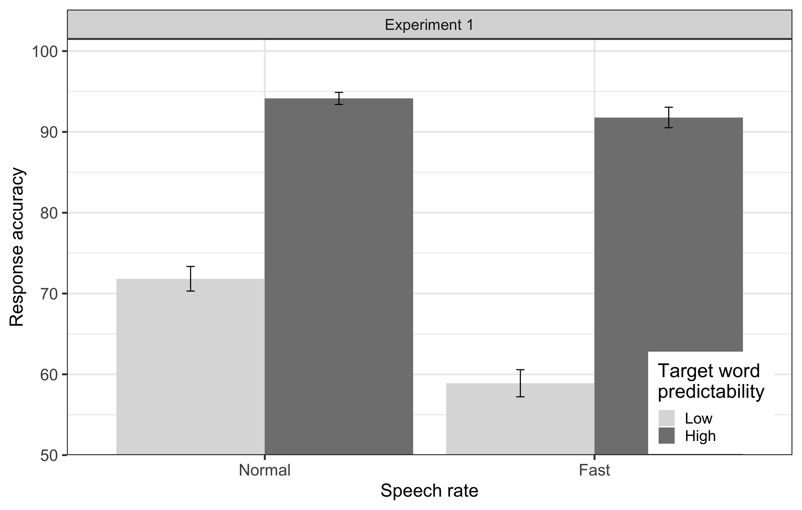
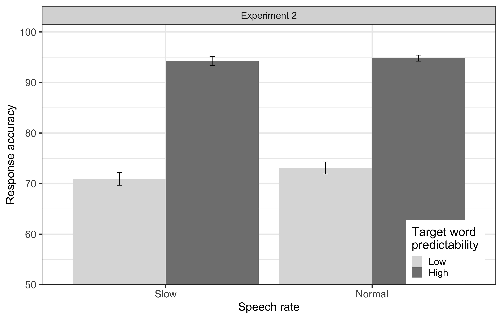

---
#########################################
# options for knitting a single chapter #
#########################################
output:
  #bookdown::html_document2: default
  #bookdown::word_document2: default
  bookdown::pdf_document2:
    template: templates/brief_template.tex
    citation_package: biblatex
documentclass: book
bibliography: [bibliography/references.bib, bibliography/additional-references.bib]
---

# Comprehension of degraded speech is modulated by the rate of speech {#chapter-speech-rate}
\chaptermark{Speech rate and predictability effects}

On the one hand, clean speech perception and reading studies have shown that contextual facilitation decreases with an increase in presentation rate (e.g., fast speech), with mixed evidence on the enhancement of contextual facilitation with a decrease in presentation rate (e.g., slow speech).
On the other hand, it has been shown that semantic predictability facilitates language comprehension at a moderate level of spectral degradation (e.g., at 4-channel noise-vocoded speech) while degraded speech perception is inherently effortful.
Considering these two lines of research and their inconsistencies,
the study reported in this chapter aimed to examine how a change in speech rate modulates contextual facilitation in language comprehension when the speech is moderately degraded by noise-vocoding through 4 channels.
To this end, we conducted two experiments:
In Experiment 1, we compared participants’ word recognition in a sentence while they listened to the moderately degraded speech presented at a normal and fast speech rates (compressed by a factor of 0.65).
In Experiment 2, we compared a separate group of participants’ word recognition in a moderately degraded speech presented at a normal and slow speech rates (expanded by a factor of 1.35).
The sentences varied in the degree of predictability of the sentence-final target word (high and low predictability).
Results of this study demonstrated that fast speech limits the time for lexical processing.
This time constraint interferes with the lexical processing of words disproportionately affecting the low predictability sentences on top of effortful listening of the moderately degraded speech
In contrast, slow speech does not amplify the contextual facilitation --- we found the lexical processing, context representation, and semantic predictions to be optimal at the normal speech rate when the speech was moderately degraded.

## Introduction

When speech is degraded, its intelligibility and comprehension are reduced.
For example, degradation by noise-vocoding reduces the spectral properties of speech rendering it difficult to understand [@Davis2005; @Shannon1995].
Studies have shown that semantic predictability facilitates comprehension of moderately degraded speech [e.g., 4-channels noise-vocoded speech, @Obleser2010],
which we have also replicated in the study presented in the previous chapter (Chapter \@ref(chapter-attention-prediction)).
That is, listeners utilise context information and form predictions about upcoming linguistic units,
which in turn facilitates the comprehension of the degraded speech.
However, prediction is a time- and resource-consuming mechanism [@Pickering2018] such that an increase or decrease in speech rate can modulate a listener’s ability to use available context information and generate linguistic predictions [cf. @Cole2020; @Ito2016].
More processing time is available at slow presentation rates (slow speech) and less at fast presentation rates (fast speech).
So, the contextual facilitation is reduced in fast speech.
However, the evidence of enhanced contextual facilitation in slow speech is mixed [@Aydelott2004; @Goy2013; @Koch2016].
Specifically for degraded speech, there is no clear evidence on how different speech rates affect the facilitatory effect (contextual facilitation) at a moderate level of degradation [@Iwasaki2002; @Meng2019; @Winn2021].

Degraded speech is intrinsically effortful to listen to [@Eckert2016; @Wild2012].
An increase (or decrease) in listening effort by a change in speech rate limits the cognitive resources available to encode the context information and form predictions [cf. @Huettig2016a].
Therefore, the present study aimed to investigate the effect of a change in speech rate on listeners' ability to generate predictions while listening to a moderately degraded speech.
One line of studies shows that at a moderate level of degradation (e.g., 4-channel noise-vocoding), semantic predictions facilitate language comprehension [e.g., @Obleser2007].
Another line of studies shows that an increase or decrease in speech rate modulates the predictability effect, i.e., contextual facilitation [e.g., @Aydelott2004; @Goy2013].
The current study is driven by an interest to bring these two lines of research together to understand the effect of speech rate on the facilitatory effect of predictability in degraded speech comprehension.
We wanted to investigate how contextual facilitation at a moderate level of spectral degradation is affected by the change in speech rate.
We expected that the contextual facilitation in degraded speech comprehension would be reduced by an increase in speech rate, while a decrease in speech rate would increase the contextual facilitation.
<!-- In the following, we first summarise the impact of speech degradation on language comprehension and its interaction with sentence context, and then the influence of speech rate on language comprehension and its interaction with sentence context.  -->

## Background

### Comprehension of fast and slow speech

A change in speech rate (by uniform time-compression or expansion) manipulates the speech signal but does not by itself produce a spectral degradation [@Charpentier1986; @Moulines1990; @Schlueter2014; but see @Longster2003].
Understanding fast speech is more effortful compared to normal and slow speech [e.g., @Mueller2019; @Winn2021; see also @Simantiraki2020],
and its intelligibility and comprehension are reduced [@Fairbanks1957; @Peelle2005; @Schlueter2014].
With an increased speech rate, processing demand increases as less time is available to process the incoming information [@Gordonsalant1995; @Rodero2016; see also @Roennberg2013].
Furthermore, some authors argue that the cognitive resources required for language processing are exhausted [@Gordonsalant2004; @Janse2009].
Since cognitive resources are also required to encode and process the context information for generating predictions [@Pickering2018], it can be expected that the effect of predictability is reduced in fast speech.
Studies comparing older and younger adults show that reduced intelligibility and comprehension in fast speech is associated with the limit of the central auditory processing system to process fast speech, identify the word, and activate its meaning [@Wingfield1999; @Wingfield2006; see also @Connolly1990; @Poldrack1998].
@Lerner2014 also show that the central auditory-language processing system is flexible and can rescale itself according to the speed of incoming information.
That is, the information processing speed in the auditory-language processing system can change per the change in speech rate,
however, there is an upper limit to the system’s flexibility.
Beyond a certain maximum speed of speech rate, the processing of fast speech becomes difficult.

In contrast, the central auditory-language comprehension system is shown to be flexible in processing slow speech without reducing its intelligibility to a certain lower limit of its rescaling capacity [@Lerner2014].
So, it can be expected that slow speech does not limit cognitive resources, and therefore processing context information to generate predictions in slow speech is not different from normal speech.
Alternatively, slow speech provides more time to buffer the auditory information at the lower level of the information processing hierarchy [@Ghitza2009; @Vagharchakian2012] and consequently provides more time for the central auditory-language comprehension system to use the context information and form predictions.
Studies from the visual world paradigm also support this claim that slow speech provides more time for speech processing and semantic predictions [@Fernandez2020; @Huettig2016a].
However, some studies have cast doubt on the processing advantage of slow speech, arguing that slow speech is perceived as overly artificial and demands high working memory [e.g., @Kemper1999; @Nejime1998; see also @Liu2006; @Love2009].
In both younger and older adults, @Sommers2020 found that slow speech does not render additional benefit in a sentence comprehension task in noise, even when supported by a visual context.
Therefore, given these competing accounts, it is unclear whether the effect of predictability increases in slow speech compared to normal speech.
Nonetheless, it is clear that a change in speech rate has different effects on speech intelligibility and language comprehension: Fast speech reduces intelligibility and comprehension,
but the evidence for the beneficial/neutral effect of slow speech on language comprehension is mixed.

A few studies have directly examined the role of fast and slow speech in listeners’ use of and benefit from semantic context by using clean speech.
For instance, @Aydelott2004 used a priming paradigm to examine the effects of contextual cues, which were target words embedded in sentences, and compared fast speech to normal speech.
Target words were either congruent to the sentence context (100\% cloze probability, i.e., in a constraining sentence context), incongruent (0\% cloze probability, i.e., in an implausible sentence), or neutral (cloze probability not mentioned).
Results indicated no reduction in the facilitatory effect of contextual cues (congruent versus neutral target words) at fast speech compared to normal speech. In contrast, they found a reduced inhibitory effect (incongruent versus neutral target words).
They argued that the constraining sentence context was easy to process --- fast speech did not interfere with the earlier stage of activation of words that matched the context (i.e., in the congruent trials).
In contrast, the inhibition effect was reduced because there was less time to build up the representation of words in implausible sentence contexts, so less inhibition of the incongruent target word was needed.
However, in a replication study of @Aydelott2004, @Goy2013 found that the facilitatory effect was reduced in fast speech compared to normal speech.
They argued that the fast speech slowed down the activation of potential target words that matched the context, effectively reducing the contextual facilitation.
In a recent study, @Winn2021 did not observe an increase in contextual facilitation for slow speech compared to normal speech, although the intelligibility was slightly higher for slow speech among cochlear implantees.
In another experiment, @Koch2016 presented participants with a question-answer sequence of varying lengths across a wide range of normal and fast speech from the clean speech of Spoken Dutch Corpus [@Oostdijk2000].
They did not find any effect of predictability on word recognition. However, their study did not systematically control target word predictability and target word position in the sentences.

The effects of varying presentation rates on semantic predictability have also been investigated with self-paced reading studies.
For example, @Wlotko2015 presented participants with context-evoking sentences followed by sentences containing a target word that was either expected (mean cloze probability of 74%) or unexpected (either same or different semantic category, both with cloze probability of approximately 0%).
They found that the facilitation effect (as reflected in the N400 amplitude) was reduced in the sentences that were presented fast compared to the ones that were presented slow.
They suggested that at a fast presentation rate, predictive preactivation of words was not common:
There was not enough time to activate proper representation to process upcoming words.
In the same study, however, the semantic facilitation effect was not reduced when the slow presentation followed the fast presentation in separate blocks.
That is, an increase in the flow of information did not always impair the ability to predict.
They argued that once the brain is engaged in predictive comprehension mode, for example, first in the slow presentation rate, it then continues to allocate resources in the same mode under a faster presentation rate.
@Dambacher2012 also showed that the N400 effect was delayed and smaller at a fast presentation rate compared to slow presentation rates.

To summarise, there is already some evidence from studies applying various paradigms that the predictability of the sentence context interacts with the presentation rate of incoming information [@Aydelott2004; @Dambacher2012; @Ito2016; @Sharit2003; @Winn2021; @Wlotko2015].
The predictability effect is generally reduced for fast speech, while the findings are inconsistent in the case of slow speech. Fast speech interferes with the lexical processing and activation of words that match the context, as limited time would be available to form expectations about an upcoming word [@Dambacher2012; @Goy2013].
In contrast, slow speech can provide more time for listeners to form a rich context representation and generate a prediction about an upcoming word than a normal speech rate [cf. @Huettig2019].


### Speech rate and contextual facilitation of moderately degraded speech

Predictions about upcoming linguistic units are generated as a listener forms a meaning representation of context information from a speech signal. Such linguistic predictions facilitate comprehension of degraded speech when the degradation is at a moderate level.
However, the effect of predictability observed at the moderate degradation level no longer exists if the listener does not understand the context. 
Therefore, it is essential that the speech rate remains within the listener's limit to buffer and process the auditory information [@Vagharchakian2012] so that the listener can form the representation of the context and have sufficient time to generate predictions. 

Several studies have examined the role of speech rate on the intelligibility and comprehension of degraded speech but without considering predictability effects.
For example, @Meng2019 found that an increase in speech rate had a much more severe effect on spectrally degraded speech (4-channel sine-wave vocoded) than on clean speech.
To achieve the same level of accuracy, listeners required degraded speech to be much slower than normal speech rate.
Among cochlear implantees whose speech input is spectrally degraded [@Shannon2004], @Iwasaki2002 found that a change in speech rate from slow to fast reduced word recognition accuracy.
Their speech perception was impaired with an increased speech rate, and it was improved when the speech rate was decreased [e.g.,@Dincer2018].
@Winn2021's study showed no significant difference in the facilitatory effect of semantic predictability between slow and normal speech rates.
This was attributed to listeners' "repair" strategy at normal speech rate such that they made sensible guesses about the words that fit the given context.
Similar to the studies conducted with clean speech, these studies also indicate that an increase in the speed of degraded speech is detrimental to its intelligibility, while its intelligibility increases with a decrease in speech rate.

Taken together, the utility of semantic predictability in comprehension of degraded speech is fairly established.
However, the findings about the effect of speech rate on predictability effect in degraded speech comprehension are inconsistent.
Similarly, prediction itself is a time- and resource-consuming mechanism [@Pickering2018] which is affected by a comprehender’s processing speed [e.g., @Huettig2016a].
However, the role of the speed of incoming information (i.e., speech rate of a degraded speech) on a listener’s ability to form predictions, and hence its interplay with the facilitatory effect of semantic predictability at a moderately degraded speech, remains unclear.
It can be speculated from the findings of the abovementioned studies that fast speech reduces the availability of time and resources to process the speech signal and generate predictions, in addition to the effortful listening of degraded speech.
It can similarly be speculated that slow speech provides listeners more time than normal speech to process the words and form a representation of context information, in addition to reducing the effortful listening of degraded speech.


### The present study

Semantic predictability has been shown to facilitate degraded speech comprehension when the degradation level is moderate at normal speech rate.
The aim of this study was to investigate whether an increase (and decrease) in speech rate reduces (and amplifies) the facilitatory effect of semantic predictability.
We systematically examined whether contextual facilitation at a moderate level of degradation varies with a change in speech rate for which
semantic predictability was manipulated by varying the cloze probability of target words in a sentence, and moderate degradation was achieved by noise-vocoding of speech through 4 channels.
4-channel noise-vocoding has been shown to be the moderate degradation level in the previous chapter, similar to the findings of @Obleser2010.
Speech rate was manipulated by time-compression (and expansion) of the moderately degraded speech to make it fast (and slow).

To achieve our aim, we conducted two experiments in which listeners were instructed to listen to the sentences and type in the entire sentence they heard.
Sentence comprehension (word recognition accuracy) for high and low predictability sentences was assessed in fast speech (Experiment 1) and slow speech (Experiment 2).
The processing demand increases, and a limited time is available to process the context and generate predictions with an increase in speech rate [e.g., @Aydelott2004; @Wlotko2015; see also @Pickering2018].
Therefore, we expected that the contextual facilitation (i.e., the increase in word recognition accuracy in high predictability sentences compared to low predictability sentences) would be reduced for fast speech compared to normal speech (Experiment 1).
However, for slow speech, due to an abundance of time to process the degraded speech and the context and reduced listening effort [e.g., @Winn2021], we expected contextual facilitation to be increased compared to normal speech (Experiment 2).
We expected that both increase and decrease in contextual facilitation would be primarily driven by the ease of processing high predictability sentences compared to low predictability sentences [@Aydelott2004; @Goy2013].

## Experiment 1: Normal vs fast speech

This experiment was conducted to investigate the effect of an increase in speech rate on predictability effect in the comprehension of the 4-channel noise-vocoded speech.
We examined if the facilitatory effect of predictability decreased as the speech sped up by a compression factor of 0.65.

### Methods

#### Participants

We recruited one group of participant (n=101; ($M$ age $\pm SD=23.14\pm 3.31$ years; age range = 18-31 years; 66 females, 1 preferred not to say) online via Prolific Academic [@Prolific].
All participants were native speakers of German and did not have any speech-language disorder, hearing loss, or neurological disorder (all self-reported).
All participants received 6.20 Euro as monetary compensation for their participation in the approximately 40 minutes long experiment.

#### Materials

In this experiment, we used a subset of materials created by the method described in Chapter \@ref(chapter-methods) (Section \@ref(experimental-materials)).
One hundred twenty sentences each for low predictability and high predictability sentences that differed in the cloze probability of sentence-final target words were used.
Mean cloze probabilities of the target words of low and high predictability sentences were $0.022\pm0.027$ ($M\pm SD$; range = 0.00-0.09) and $0.752\pm0.123$ ($M\pm SD$; range = 0.56-1.00) respectively.
The audio recodings of all 240 sentences were compressed by a factor of 0.65 in Praat software to create fast speech (see Chapter \@ref(chapter-methods) Section \@ref(compression-expansion) for details).
Then the recordings of speech signal at fast rate and normal rate were passed through 4 channels of noise-vocoding to create moderately degraded speech stimuli of two types: fast speech and normal speech (see Chapter \@ref(chapter-methods) Section \@ref(noise-vocoding) for details).

Each participant was presented with 120 unique sentences: 60 HP and 60 LP sentences.
Speech rate was also balanced across each predictability level.
The participants received 30 sentences with normal speed and 30 with fast speed in each of the predictability conditions resulting into 4 experimental lists.
The sentences in each list were pseudo-randomised, that is, not more than 3 sentences of same speed, or same predictability condition appeared consecutively.

#### Procedure

Participants were asked to use earphones or headphones.
A sample of vocoded speech not used in the main experiment and the practice trial was provided so that the participants could adjust the volume to a preferred level of comfort at the beginning of the experiment.
The participants were instructed to listen and report the entire sentences by typing in the everything they heard using the keyboard.
The time for typing in the response was not limited.
They were informed at the beginning of the experiment that some of the sentences would be ‘noisy’ and not easy to understand.
Guessing was encouraged.
To familiarise the participants with the task, eight practice trials with different levels of speech degradation were provided before presenting all 120 experimental trials with an intertrial interval of 1,000 ms.

Each participant was presented 60 high and 60 low predictability sentences.
Speech rate was also balanced across each predictability condition.
For each predictability condition, 30 sentences with fast speech and 30 with normal speech were presented.
Sentences were pseudo-randomised so that no more than three sentences of the same predictability level or speech rate appeared consecutively.
A total of four lists were constructed.

### Analyses

We have already shown in the previous chapters that predictability effects, i.e., contextual facilitation in language comprehension can be rightfully measured only if we consider the trials in which participants accurately identify the context.
Verbs are predictive of the nouns in our stimuli (e.g., *Sie jongliert die Bälle*).
Therefore, we discarded the trials in which verbs were identified incorrectly.

Accuracy was analysed using Generalized Linear Mixed Models (GLMMs) following the procedure described in Chapter \@ref(chapter-stats) (Section \@ref(analysis-main)) similar to the preceding chapters.
Binary responses (categorical: correct and incorrect) for all participants were fit with a [binomial linear mixed-effects model](#binomial-logistic-mixed-effects-model).
Correct responses were coded as 1, and incorrect responses were coded as 0.
Speech rate (categorical: fast speech and slow speech), target word predictability (categorical: high predictability sentences and low predictability sentences), and their interaction were included in the fixed effects.
We fitted a model with a maximal random effects structure that included random intercepts for each participant and item [@Barr2013].
Both by-participant and by-item random slopes were included for speech rate, target word predictability, and their interaction,
which was supported by the experiment design.
We applied treatment contrast for both predictability and speech rate, mapping low predictability and normal speech to the intercept.

### Results and discussion

<!--
```{=tex}
\begin{longtable}[]{@{}lllc@{}}
\caption{Response accuracy (mean and standard error of the mean) across all levels of speech rate and target word predictability in Experiment 1}
\label{summary3a}
\tabularnewline
\toprule
Speed & Target word predictability & Mean & Standard
error \\
\midrule
\endfirsthead
\toprule
Speed & Target word predictability & Mean & Standard
error \\
\midrule
\endhead
Fast & Low & 58.93 & 1.54 \\
& High & 91.78 & 1.23 \\
Normal & Low & 71.82 & 1.37 \\
& High & 94.13 & 1.01 \\
\bottomrule
\end{longtable}
```
-->

: (\#tab:summary3a) Response accuracy (mean and standard error of the mean) across all levels of speech rate and target word predictability in Experiment 1

| Speed  | Target word predictability | Mean  | Standard error |
|:-------|:---------------------------|:-----:|:--------------:|
| Fast   | Low                        | 58.93 |      1.54      |
|        | High                       | 91.78 |      1.23      |
| Normal | Low                        | 71.82 |      1.37      |
|        | High                       | 94.13 |      1.01      |

Mean response accuracies (in percentage) for all experimental conditions aggregated across all participants and items are shown in Table \@ref(tab:summary3a) and Figure \@ref(fig:figure3a).
It shows that accuracy increases with an increase in target word predictability, but it decreases with an increase in speech rate.
The results of the statistical analysis confirmed these observations (Table \@ref(tab:results3a)).

```{r figure3a, eval=TRUE, echo=FALSE, fig.align='center', fig.cap="Mean response accuracy across all conditions in Experiment 1. Accuracy increased only with an increase in the target-word predictability and a decrease in speech rate. Error bars represent the standard error of the means.", out.width="95%"}

```

<!--
```{=tex}
\begin{table}[ht]
\begin{center}
\caption{Estimated effects of the model accounting for the correct word recognition in Experiment 1}
\label{results3a} 
\vskip 0.12in
\begin{tabular}[]{@{}lrrrr@{}}
\toprule
Fixed effects & Estimate & Std. Error & \emph{z} value & \emph{p}
value \\
\midrule
Intercept & 1.34 & .24 & 5.58 & \textless.001 \\
\\
Speech rate (Fast) & -.98 & .24 & -4.16 & \textless.001 \\
\\
Target word predictability (High) & 2.42 & .28 & 8.55 & \textless.001 \\
\\
Speech rate $\times$ Target word predictability & 1.06 & .42 & 2.50 & .012 \\
\bottomrule
\end{tabular} 
\end{center} 
\end{table}
```
-->

: (\#tab:results3a) Estimated effects of the model accounting for the correct word recognition in Experiment 1

| Fixed effects                                   | Estimate | Std. Error | *z* value | *p* value |
|---------------|--------------:|--------------:|--------------:|--------------:|
| Intercept                                       |     1.34 |        .24 |      5.58 |     <.001 |
| Speech rate (Fast)                              |     -.98 |        .24 |     -4.16 |     <.001 |
| Target word predictability (High)               |     2.42 |        .28 |      8.55 |     <.001 |
| Speech rate $\times$ Target word predictability |     1.06 |        .42 |      2.50 |      .012 |

We found a significant main effect of target word predictability ($\beta$ = 2.42, SE = .28, *z* = 8.55, *p* < .001) and a significant main effect of speech rate ($\beta$ = -.98, SE = .24, *z* = 4.16, *p* < .001)
suggesting that participants’ response accuracy was higher for the high predictability sentences than for the low predictability sentences and for normal speech than for fast speech.
We also found a significant interaction between target word predictability and speech rate ($\beta$ = 1.06, SE = .42, *z* = 2.50, *p* = .01).
These findings show that the effect of target word predictability, i.e., contextual facilitation was reduced at fast speech (see Figure \@ref(fig:figure3a)).

Separate planned analyses of each predictability level were performed.
There was no significant main effect of speech rate at high predictability condition ($\beta$ = .02, SE = .34, *z* = .05, *p* = .96).
At low predictability condition, in contrast, we found a significant main effect of speech rate ($\beta$ = -.99, SE = .27, *z* = -3.72, *p* < .001).
Hence, response accuracy decreased at fast speech, but only for the low predictability sentences. 

Separate planned analyses of each speech rate revealed that there was significant main effect of predictability in both normal speech ($\beta$ = 1.98, SE = .28, *z* = 7.05, *p* < .001) and fast speech ($\beta$ = 2.67, SE = .37, *z* = 7.14, *p* < .001),
but the effect appeared to be higher for fast speech ($\beta$ = 2.67) than for normal speech ($\beta$ = 1.98).
This resulted from a significant drop in accuracy at the low predictability condition rather than a rise in accuracy at high predictability condition in the fast speech.

These results indicated an increase in response accuracy with an increase in target word predictability only at the normal speech rate.
Fast speech rate significantly reduced the accuracy in the low predictability condition.
It suggests that fast speech incurs a cost in processing the low predictability sentences and reduces the contextual facilitation in degraded speech comprehension.
These findings also align with previous studies conducted with clean speech, which reported that fast speech reduces contextual facilitation [e.g., @Aydelott2004].

We conducted another experiment to examine if slowing down the speech rate eases the processing of both low and high predictability sentences and increases the contextual facilitation in comprehension of moderately degraded speech.

## Experiment 2: Normal vs slow speech

Following up on Experiment 1, we conducted Experiment 2 on a separate group of participants to investigate the effect of a decrease in speech rate on predictability effect in the comprehension of the 4-channel noise-vocoded speech.
We examined if the facilitatory effect of predictability increased as the speech slowed down by an expansion factor of 1.65.

### Methods

#### Participants and Materials

We recruited another group of participant (n=101; $M$ age $\pm SD=23.49\pm 3.26$ years; age range = 18-30 years; 60 females, 1 preferred not to say) online via Prolific Academic [@Prolific].
The same sentences were used as stimuli as in Experiment 1.
Instead of compression, the auditory recordings were expanded by a factor of 1.35 to create slow speech.
The rest of the procedure, including the noise-vocoding through 4 channels, to create stimuli were the same as in Experiment 1.
This resulted in two types of 4-channel noise-vocoded speech: slow speech and normal speech.

#### Procedure

The same procedure was followed as in Experiment 1.
Participants were asked to use earphones or headphones.
They were instructed to report the entire sentence by typing in what they heard.

Four experimental lists were constructed to present each participant with 60 high and 60 low predictability sentences.<!--(see Appendix D).-->
Speech rate was also balanced across each predictability condition in each list. For each predictability condition, 30 sentences with slow speech and 30 with normal speech were presented.
Sentences were pseudo-randomised so that no more than three sentences of the same predictability level or speech rate appeared consecutively.

### Analyses

The data analysis procedure was the same as Experiment 1.
Accuracy was analysed using Generalized Linear Mixed Models (GLMMs).
We fit a model with maximal random effects structure.
Treatment contrast was applied for both predictability and speech rate, mapping low predictability and normal speech to the intercept.

### Results and discussion

<!--
```{=tex}
\begin{longtable}[]{@{}lllc@{}}
\caption{Response accuracy (mean and standard error of the mean) across all levels of speech rate and target word predictability in Experiment 2}
\label{summary3b}
\tabularnewline
\toprule
Speed & Target word predictability & Mean & Standard
error \\
\midrule
\endfirsthead
\toprule
Speed & Target word predictability & Mean & Standard
error \\
\midrule
\endhead
Slow & Low & 70.92 & 1.09 \\
& High & 94.25 & .89 \\
Normal & Low & 73.09 & 1.02 \\
& High & 94.82 & .70 \\
\bottomrule
\end{longtable}
```
-->

: (\#tab:summary3b) Response accuracy (mean and standard error of the mean) across all levels of speech rate and target word predictability in Experiment 2

| Speed  | Target word predictability | Mean  | Standard error |
|:-------|:---------------------------|:-----:|:--------------:|
| Slow   | Low                        | 70.92 |      1.09      |
|        | High                       | 94.25 |      .89       |
| Normal | Low                        | 73.09 |      1.02      |
|        | High                       | 94.82 |      .70       |

Mean response accuracies (in percentage) for all experimental conditions aggregated across all participants and items are shown in Table \@ref(tab:summary3b) and Figure \@ref(fig:figure3b).
It shows that accuracy increases with an increase in target word predictability
but did not increase with a decrease in speech rate.
The results of the statistical analysis confirmed these observations (Table \@ref(tab:results3b)).

```{r figure3b, eval=TRUE, echo=FALSE, fig.align='center', fig.cap="Mean response accuracy across all conditions in Experiment 2. Accuracy increased only with an increase in the target-word predictability, but a change in speech rate had no significant effect on accuracy. Error bars represent the standard error of the means.", out.width="95%"}

```

<!--
```{=tex}
\begin{table}[ht]
\begin{center}
\caption{Estimated effects of the model accounting for the correct word recognition in Experiment 2}
\label{results3b} 
\vskip 0.12in
\begin{tabular}[]{@{}lrrrr@{}}
\toprule
Fixed effects & Estimate & Std. Error & \emph{z} value & \emph{p}
value \\
\midrule
Intercept & 1.41 & .23 & 6.20 & \textless.001 \\
\\
Speech rate (Slow) & -.08 & .14 & -.57 & .568 \\
\\
Target word predictability (High) & 2.58 & .30 & 8.65 & \textless.001 \\
\\
Speech rate $\times$ Target word predictability & .44 & .27 & 1.65 & .099 \\
\bottomrule
\end{tabular} 
\end{center} 
\end{table}
```
-->

: (\#tab:results3b) Estimated effects of the model accounting for the correct word recognition in Experiment 2

| Fixed effects                                   | Estimate | Std. error | *z* value | *p* value |
|---------------|--------------:|--------------:|--------------:|--------------:|
| Intercept                                       |     1.41 |        .23 |      6.20 |     <.001 |
| Speech rate (Slow)                              |     -.08 |        .14 |      -.57 |      .568 |
| Target word predictability (High)               |     2.58 |        .30 |      8.65 |     <.001 |
| Speech rate $\times$ Target word predictability |      .44 |        .27 |      1.65 |      .099 |


We again found a significant main effect of target word predictability, indicating that participants’ response accuracy was higher for the high predictability condition than for the low predictability condition ($\beta$ = 2.58, SE = .30, *z* = 8.65, *p* < .001),
replicating the effect in the previous experiment.
In contrast to Experiment 1, we did not find a significant main effect of speech rate ($\beta$ = -.08, SE = .15, *z* = .57, *p* = .568),
nor there was a significant interaction between speech rate and target word predictability ($\beta$ = .44, SE = .27, *z* = 1.65, *p* = .099).
The absence of the main effect of speech rate and the interaction between speech rate and predictability suggested that there was no change in participants’ response accuracy with a reduction in speech rate,
and the contextual facilitation did not significantly increase or decrease with slowing down of the speech rate.

In contrast to Experiment 1, Experiment 2 did not indicate a differential effect of speech rates in the comprehension of high and low predictability sentences.
While Experiment 1 showed that speeding up the speech rate significantly reduced the accuracy of low predictability sentences, such a reduction was not observed in Experiment 2 when the speech rate was slowed down.
Although listeners’ response accuracy was reduced in both fast and slow speech than in normal speech, their ability to utilise context information was only impaired by the fast speech in the low predictability sentences.

## Conclusion

The main goal of the present study was to examine whether the contextual facilitation (i.e., the facilitatory effect of semantic predictability) in comprehension of a moderately degraded speech is modulated by changes in speech rate.
The results of two experiments revealed that fast speech selectively impedes the comprehension of low predictability sentences, while slow speech has no detrimental or beneficial effect on contextual facilitation.

In both experiments, our results showed a significant main effect of predictability at normal speech rate,
i.e., we observed a facilitatory effect of semantic predictability at normal speech rate under moderate degradation level by noise-vocoding through 4 channels.
This replicates the findings of earlier studies [e.g., @Obleser2010] and the study presented in Chapter \@ref(chapter-graded-prediction) in which participants were presented only with normal speech rate, and contextual facilitation was observed at the spectral degradation through 4-channel noise-vocoding.
At this moderate degradation level, listeners could decode the context and form its meaning representation.
Consequently, they generated predictions about the upcoming target word in a sentence even in low predictability conditions depending on the contextual constraint of the sentences [cf. @Strauss2013].

The expected interaction between speech rate and target word predictability in Experiment 1 showed that comprehension of degraded speech was significantly impaired for low predictability sentences but not for high predictability sentences in fast speech.
Listening to degraded speech is effortful and requires more attentional resources than clean speech [@Wild2012].
When presented as a fast speech, spectral degradation imposes additional cognitive demands; and less time is available to process the speech signal.
The central auditory-language processing system does not rescale itself according to the speed of the fast speech presented in Experiment 1 [@Lerner2014].
It is then difficult to process the fast speech, decode the context information and form its meaning representation from the degraded speech to generate predictions about upcoming target words.
This disproportionately affects low predictability sentences as fast speech interferes with the lexical processing of words, likely reducing the activation of target words in less constraining sentence contexts [@Aydelott2004; @Dambacher2012; cf. @Goy2013].
As a result, language comprehension in the low predictability condition is impaired more than in the high predictability condition in Experiment 1.

In contrast to Experiment 1, we did not find the expected interaction between speech rate and target word predictability in Experiment 2,
i.e., a decrease in speech rate did not differentially affect the comprehension of high or low predictability sentences.
Unlike Experiment 1, we did not observe a significant change in contextual facilitation in the slow speech at 4-channel noise-vocoding level in Experiment 2.
Slowing down the speech gives listeners more time to process the information, including the context that is important to generate predictions.
However, our findings show that the added time in slow speech does not benefit intelligibility and comprehension of sentences more than the normally available time at a normal speech rate.
Comprehenders' lexical processing is optimal at the normal presentation rate [@Dambacher2012].
Although slow speech reduces effortful listening of degraded speech, the resources thus freed up by the slow speech are not allocated to enhance contextual facilitation.
This argument is in line with @Winn2021, who reported that contextual facilitation does not increase when the speech is slowed down.
Alternatively, it is plausible that the artificial expansion of speech introduced distortion in the speech signal.
Although speech intelligibility and comprehension are increased by slow speech [@Iwasaki2002; @Dincer2018], acoustic distortion due to artificial expansion reduces intelligibility and comprehension [@Longster2003].
As a result, we did not observe an overall amplification of contextual facilitation in the slow speech at the moderate degradation level in Experiment 2.

Accounts from speech perception and predictive language processing point to a common expectation: contextual facilitation is enhanced when comprehenders have more time to process the presented information [@Huettig2019; @Ito2016; @Kuperberg2016].
However, there is conflicting empirical evidence on whether an increase or a decrease in speech rate benefits intelligibility, comprehension, and contextual facilitation.
Our findings show this interplay among spectral degradation, speech rate, and semantic prediction.
Although reducing the speech rate provides time to process the information (including the context) in the degraded speech, this does not necessarily ease the processing of high or low predictability sentences differentially.
Thus, no increased facilitatory effect is observed at the slow speech rate.
In contrast, increasing the speech rate adds more cognitive load on top of the effort required to listen to the degraded speech.
This results in difficulty processing and understanding the rapidly unfolding sentences; this difficulty further increases when the target words are not easily predictable. 

Similarly, in the “narrowed expectations” framework of degraded speech comprehension, @Strauss2013 argue that lexical-semantic cues are more robust to degradation and the target words can be processed faster and relatively more easily in a highly constraining context than in a less constraining context.
They posit that listeners can activate a narrow range of most likely target words from the context in a high predictability sentence.
Our results show that when the moderately degraded speech is sped up, the context is still robust:
There is enough processing time available in the fast speech to process the context and generate a small range of lexical predictions about an upcoming target word in a high predictability sentence.
Therefore, the comprehension of high predictability sentences is not reduced due to an increase in speech rate.
However, in a low predictability sentence, the range of probable sentence endings is too wide to generate enough lexical predictions that facilitate comprehension.
When the processing time is short, it further reduces the activation of likely sentence endings, especially when the context is less constraining [@Aydelott2004].  

An alternative explanation of our findings of contextual facilitation could be that the listeners first identified the noun (e.g., Bälle), then integrated it with the verb (e.g., jongliert) instead of first identifying the verb and predicting the noun.
To rule this out, we conducted an additional analysis, the results of which supported the prediction-based explanation.
We compared the effect (estimates) of forward-predictability (from the verb to noun) with that of backward guessing (identifying the verb from the correct identification of the noun).
In both experiments, the forward predictability effect was larger than the backward guessing.
The results of these complementary analyses (see Appendix \@ref(appendix-C)) favour the explanation that the contextual facilitation we observed is due mainly to predictability rather than backward guessing (or backward integration).

Of note, the generalisation of our results is limited. First, we tested only with one expansion factor of 1.35 and one compression factor of 0.65.
It can be speculated that an increase in facilitatory effect could be observed when the speech is expanded to different levels by including other expansion factors.
There could be an optimal trade-off between slowing down the speech with more time to process [@Fernandez2020] and the speech still remaining intelligible.
This could be further explored in alternate experimental designs or methods:
Instead of using PSOLA to create slow speech, silent pauses can be inserted in a speech stream (in the semantic or syntactic boundaries between the words) to create slow speech that sounds more natural [@Wingfield1999],
or the speech can be recorded in a desired (slow or fast) natural-sounding speech rate [@Adank2009] before noise-vocoding it.
These methods have disadvantages like the omission of coarticulatory cues due to the insertion of pauses, slow-sounding speech being different from conversational speech, and difficulty maintaining a constant speed in the slower speech rates while recording.
Nevertheless, one can reduce the additional degradation that can be caused by algorithmic speech expansion and, at the same time, use a wide range of slow speech rates that allow listeners to process the spectrally degraded speech at meaningful semantic and syntactic boundaries.

Second, we only tested younger adults.
We did not examine the effect of cognitive ageing on contextual facilitation of comprehension of fast and slow speech.
Older adults have delayed processing speed such that slow speech generally improves their speech intelligibility and language comprehension.
Furthermore, semantic context benefits older adults more than younger adults in adverse listening conditions.
Therefore, the effect of slow speech could be different in older adults than what we found in younger adults under adverse listening conditions.

To conclude, we show that access (or restriction) to lexical processing is associated with the speed of information flow, and the constraints in attentional and cognitive resources are key factors that influence contextual facilitation of moderately degraded speech.
Lexical processing is restricted in an effortful listening of the rapidly unfolding degraded speech;
consequently, understanding the words that are not easily predictable from the context is difficult.
On the contrary, auditory-language comprehension is optimal in the normal speech rate, and thus, slowing down the degraded speech does not necessarily amplify contextual facilitation. 


## Summary

This chapter reported studies investigating the effect of changes in speech rate on contextual facilitation of a moderately degraded speech.
While it was already shown in the preceding chapter that at a normal speech rate, predictability facilitates comprehension of degraded speech at 4-channel noise-vocoding level,
in this chapter, the effect of increase and decrease of speech rate on this predictability effect was investigated.
When the speech rate is increased, we found that activating target words using the context information is more difficult in the low predictability sentences than in the high predictability sentences.
This is on top of the fact that fast speech adds further load in processing the inherently effortful degraded speech.
In contrast, slowing down the moderately degraded speech did not provide any benefit in the comprehension of high or low predictability sentences.
Although slow speech reduces the effort on listening to degraded speech,
this chapter concluded that thus freed up resources are not necessarily used to amplify the predictability effects.
All in all, this chapter revealed that the bottom-up perceptual property, like speech rate, interacts with the top-down predictive processes, in addition to other perceptual properties, like speech degradation;
however, the nature of this interaction depends on the nature of the speech (i.e., fast vs slow).

In the next chapter, we provide a concluding remark on the studies presented in Chapters \@ref(chapter-attention-prediction), \@ref(chapter-graded-prediction), and \@ref(chapter-speech-rate).
We discuss the limitations of the studies, their generalisation, and future outlook.

